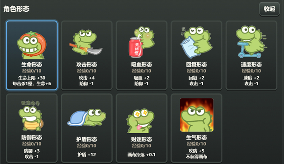
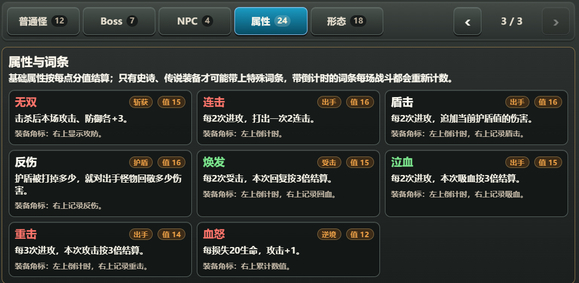

# 图片勇者

拍下身边小物，或亲手画出一件装备，让图文模型把你的图片鉴定成登塔战力。

<p align="center">
  <a href="https://kw66.github.io/photo-hero/"><strong>点击即玩</strong></a>
  ·
  <a href="https://xhslink.com/m/A2DFslJF4mb">作者小红书：落星峦</a>
  ·
  <a href="http://xhslink.com/o/17XFWimxM94">小红书交流帖</a>
  ·
  <a href="https://github.com/kw66/photo-hero">GitHub 项目</a>
  ·
  <a href="https://kw66.github.io/PhD_Simulator/">研究生模拟器 v1.0</a>
</p>

<p align="center">
  
  
</p>
<p align="center">
  
  
</p>

---

## 这是什么

《图片勇者》是一款纯前端 H5 魔塔式图文爬塔游戏。玩家可以在两种完全等价的模式之间随时切换：

- **照片勇者**：用手机相机或相册上传现实小物，把它鉴定成装备。
- **画图勇者**：打开画布手动画一件物品、道具或装备，把简笔画鉴定成装备。

模式切换只影响下一次消耗的是“胶卷”还是“画布”，以及装备格显示相机还是画笔。已经生成的装备不会改变，战斗、奖励和成长规则完全一致。

游戏目前包含 40 层爬塔、Boss、隐藏救援层、照片/画图鉴定、装备词条、勇者形态、冒险手册、怪物/NPC/词条图鉴，以及通关和失败两种结局。

## 核心体验

- **图片变装备**：现实物品、日常小物、玩家手绘和幻想道具都可以进入鉴定台。
- **图文模型识别，本地规则结算**：模型负责理解图片主体和语义倾向；价值、品质、属性、词条由本地规则统一计算，避免不同模型把数值吹得过高。
- **照片与画图双模式**：照片更看重真实拍摄和主体清晰；画图更看重主体可识别、线条结构、配色和完整度。
- **魔塔式推进**：普通层可选择 1 到 3 个怪物挑战，Boss 层和奖励强敌提供三选一奖励。
- **装备词条技能化**：史诗和传说装备可能获得词条，部分词条会在战斗中显示冷却、计数和本场累计加成。
- **隐藏救援层**：每 10 层区间都有隐藏事件，救出老人、商人、小偷、公主可以获得关键奖励。
- **冒险手册**：内置玩法、战斗、怪物、Boss、NPC、勇者形态和装备词条图鉴。
- **公共体验鉴定台**：默认可以免配置试玩，也可以切换到自己的 OpenAI-compatible 图文模型 API。

## 快速开始

公开网页：

```text
https://kw66.github.io/photo-hero/
```

推荐第一次游玩：

1. 打开网页后先领取开局三张胶卷/画布，全部选中后进入塔内。
2. 默认 `体验` 鉴定台无需填写地址、模型和 API Key；公共额度繁忙时，可以切换到自己的接口。
3. 点击空装备格。照片勇者会拍照或上传图片，画图勇者会打开画布。
4. 点击鉴定，等待模型识别并生成装备。
5. 进入楼层后点击怪物卡牌选择目标，再点击战斗。
6. 打开 `冒险手册` 可以查看拍照/画图规则、战斗机制和图鉴。

## 鉴定规则

鉴定分成“模型理解”和“本地结算”两步：

- 图文模型负责识别图片主体、判断照片/画图质量、给出属性倾向和词条候选。
- 本地代码会重新计算最终价值、品质、属性和词条，并过滤不合理结果。
- 照片鉴定鼓励现实实拍、主体清楚、大小适合携带的物品，抑制网图、截图、素材图、电商图和过大场景。
- 画图鉴定会先判断主体是否可识别，再看线条连贯、结构完整、配色和整体观感；未成形线团或看不出主体的图不会生成可用装备。
- 图片里的文字不会作为装备判断依据，命名和属性主要看可见图像主体。
- 鉴定失败、取消、超时或 JSON 解析失败不会消耗胶卷/画布，也不会清空已经拍好或画好的图。

更细的回归记录见 [`docs/appraisal-regression.md`](docs/appraisal-regression.md)。

## 玩法概览

### 胶卷与画布

- 每次普通鉴定消耗 1.0 胶卷/画布。
- 击败怪物、救援 NPC、Boss 奖励会补充后续鉴定资源。
- 分解装备会按品质返还资源：普通 0.3、稀有 0.5、史诗 0.7、传说 0.9。
- 已装备的装备可以重鉴定，消耗为 `1.0 - 分解返还`，方便玩家用更低成本重试一次。

### 战斗与成长

- 普通层通常有 3 张怪物卡牌，可选择 1 到 3 只怪物挑战，也可以取消选择。
- 多选怪物可以更快获得资源，但多个敌人会一起行动，风险更高。
- 护盾每场战斗刷新，先于生命承伤。
- 回复在受击后触发，吸血在勇者进攻后触发。
- 勇者战败后会显示失败结局，并且仍然可以查看装备。
- 击败第 40 层魔王可以通关；如果救出隐藏 4 的公主，则进入真结局。

### 隐藏救援层

每 10 层区间有一个隐藏层。触发方式是：在普通楼层击败系统随机指定的非最弱怪物后，下一层会先进入隐藏层。前 4 层和 Boss 层不会触发隐藏层。

| 隐藏层 | 触发区间 | 看守怪物 | NPC | 奖励 |
| --- | --- | --- | --- | --- |
| 隐藏1 | 第 5-9 层 | 2 个守卫 | 老人 | 所有勇者形态经验 +2 |
| 隐藏2 | 第 11-19 层 | 2 个兽人 | 商人 | 胶卷/画布 +2.0 |
| 隐藏3 | 第 21-29 层 | 2 个骑士 | 小偷 | 获得宝石，攻击、防御、速度 +1 |
| 隐藏4 | 第 31-39 层 | 2 个剑士 | 公主 | 生命回满，并开启真结局条件 |

## 公共体验与 API

线上页面是 GitHub Pages 静态网页。当前有两类鉴定方式：

1. **体验模式**：默认选中，走 Cloudflare Worker 公共鉴定台。公共 API Key 存在 Worker Secret 中，不会出现在浏览器页面里。公共额度有限，繁忙时会提示稍后再试或切换到自己的 API。
2. **自定义 / 预设 API**：玩家在浏览器里填写自己的接口和 API Key。配置只保存在本机浏览器 `localStorage`，请求由浏览器发往所选服务商。

当前预设包括 `体验`、`硅基流动`、`小米`、`智谱`、`米醋` 和 `自定义`。可用性取决于对应模型是否支持图片输入、OpenAI-compatible `/chat/completions` 和浏览器跨域请求。

## 本地运行

Node 只用于本地静态预览和回归脚本，不参与 GitHub Pages 玩家访问。默认 `体验` 模式也会走 Cloudflare Worker；只有调试本地代理时，才需要在页面加载前显式设置 `window.PHOTO_HERO_EXPERIENCE_PROXY_BASE_URL`。

```powershell
npm start
```

然后打开：

```text
http://localhost:3000
```

常用检查：

```powershell
npm run qa:review
node scripts\appraisal-lite-regression.cjs
node scripts\experience-proxy-regression.cjs
```

## 项目结构

```text
photo-hero/
├── index.html                         # 页面结构
├── styles.css                         # 界面样式
├── app.js                             # 游戏逻辑、鉴定、战斗、存档
├── assets/
│   ├── audio/                         # 音效
│   ├── effects/                       # 打击特效
│   ├── heroes/                        # 勇者形态图片
│   ├── info/                          # 小红书二维码等信息素材
│   ├── monsters/                      # 怪物图片
│   ├── monster-animations/            # 怪物动画帧
│   ├── music/                         # BGM
│   ├── npcs/                          # NPC 图片
│   ├── readme/                        # GitHub 展示截图
│   ├── rewards/                       # Boss 奖励图标
│   └── tiles/                         # 地板、墙体纹理
├── docs/
│   └── appraisal-regression.md        # 鉴定规则回归表
├── scripts/
│   ├── appraisal-lite-regression.cjs   # 鉴定规则回归
│   ├── experience-proxy-regression.cjs # Worker 代理回归
│   └── review-qa.cjs                  # UI 文案/结构检查
├── workers/
│   └── experience-proxy.js            # Cloudflare Worker 公共鉴定台
└── server.js                          # 本地静态预览服务
```

## 素材来源

- 怪物、物品、NPC 图片，以及音乐、音效素材来源于《魔塔50层》。
- 勇者形态图片来源于表情包“抹茶旦旦”。

当前项目是个人学习与原型迭代用途。如果后续做更正式的公开发布或商业化版本，需要继续整理授权边界，或替换为自制/可商用授权素材。

## 当前状态

这是一个仍在快速迭代的网页游戏原型。核心目标是验证一种轻量的小型图文玩法：让玩家通过现实拍照或手动画图，把自己的输入变成游戏里的成长资源。

欢迎试玩、反馈鉴定结果、提交问题，也欢迎给项目点 star。
