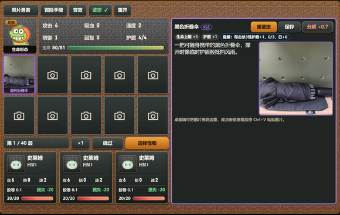
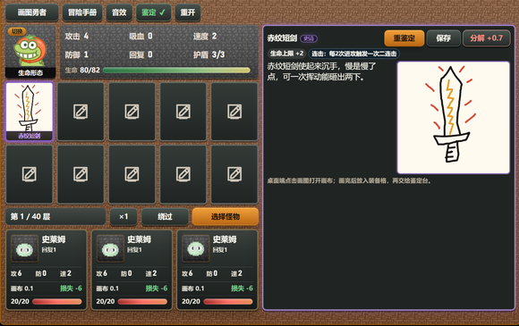

# 图片勇者

  🖼️ 用 AI 把照片和简笔画鉴定成装备的爬塔 RPG 小游戏

  📸 拍下一个小物，或者亲手画出一个道具。 
  ⚔️ 交给 AI 大模型鉴定，生成属于你的爬塔装备。

  <a href="https://kw66.github.io/photo-hero/"><strong>🎮 点击即玩</strong></a>
  ·
  <a href="https://kw66.github.io/games/"><strong>👤 作者游戏合集</strong></a>

  
  

## 项目简介

《图片勇者》是一款 H5 爬塔 RPG。玩家可以在 **照片勇者** 和 **画图勇者** 两种模式之间随时切换，把现实小物或手绘简笔画鉴定成装备，带着它们挑战 40 层魔塔。

## 核心玩法

| 模块 | 内容 |
| --- | --- |
| 📷 照片勇者 | 拍摄或上传现实小物，把清晰可识别的物品鉴定成装备 |
| 🎨 画图勇者 | 打开画布手绘物品、道具或装备，把简笔画鉴定成装备 |
| ⚔️ 爬塔战斗 | 普通层可选择 1 到 3 只怪物挑战，Boss 层和奖励强敌提供关键奖励 |
| 🧬 装备词条 | 稀有及以上装备可能获得特殊词条，部分词条会在战斗中显示计数和加成 |
| 🧍 勇者形态 | 多种形态提供不同成长方向，形态进化后获得更强效果 |
| 🕳️ 隐藏救援 | 每 10 层区间可能触发隐藏层，救出 NPC 可获得额外奖励 |
| 📘 冒险手册 | 内置玩法说明、战斗机制、怪物、Boss、NPC、形态和词条图鉴 |

## 鉴定规则

| 输入 | 判断重点 | 结果倾向 |
| --- | --- | --- |
| 照片 | 真实实拍、主体清楚、大小适合携带 | 更容易获得稳定装备 |
| 简笔画 | 主体可识别、轮廓完整、线条连贯、配色清楚 | 认真绘制会获得更贴合的装备 |
| 图片文字 | 不作为装备判断依据 | 主要看可见图像主体 |
| 失败/超时 | 不消耗胶卷或画布 | 保留已拍照片或已画作品，可再次鉴定 |

## 快速开始

| 操作 | 说明 |
| --- | --- |
| 进入游戏 | 打开 <https://kw66.github.io/photo-hero/> |
| 开局资源 | 先领取三张胶卷/画布，全部选中后进入塔内 |
| 生成装备 | 点击空装备格，拍照或画图后交给鉴定台 |
| 开始战斗 | 进入楼层后点击怪物卡牌选择目标，再点击战斗 |
| 查看资料 | 打开冒险手册查看规则、怪物、Boss、NPC、形态和词条 |

## 素材来源

| 素材 | 来源 |
| --- | --- |
| 怪物、物品、NPC、音乐、音效 | 《魔塔50层》 |
| 勇者形态图片 | 表情包“抹茶旦旦” |

当前项目是个人学习与原型迭代用途。若后续做更正式的公开发布或商业化版本，需要继续整理授权边界，或者替换为自制 / 可商用授权素材。
